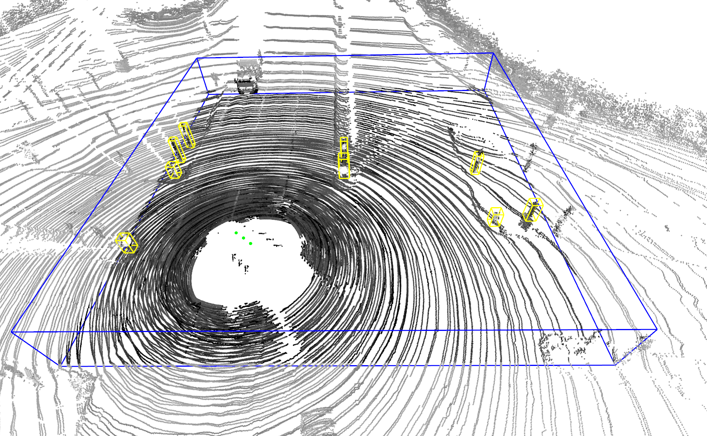
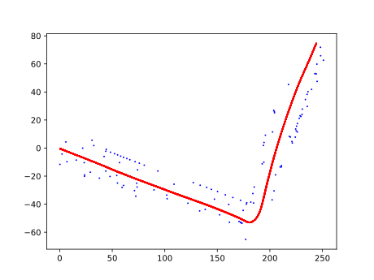

# Long-Term Urban Vehicle Localization Using Pole Landmarks Extracted from 3-D Lidar Scans

This repository contains the Python code that accompanies our paper ["Long-Term Urban Vehicle Localization Using Pole Landmarks Extracted from 3-D Lidar Scans"](http://ais.informatik.uni-freiburg.de/publications/papers/schaefer19ecmr.pdf) submitted to the [European Conference on Mobile Robots](https://www.ecmr2019.eu/).
The implementation allows to

* extract the parameters of pole-like objects from 3-D lidar scans,
* create a global reference map of pole landmarks,
* localize a vehicle online based on the reference map and live lidar measurements,
* replicate the experiments on the [NCLT dataset](http://robots.engin.umich.edu/nclt/) and on the [KITTI dataset](http://www.cvlibs.net/datasets/kitti/) described in the paper.

It provides the following three software modules.

### [Pole extractor](poles/poles.py)

This module takes odometry and 3-D lidar scans accumulated over a short trajectory segment as input, searches for pole-like objects in the data, and outputs the parameters of the corresponding pole estimates.


<br/>*Pole extraction from NCLT lidar data.*


<br/>*Pole extraction from KITTI lidar data.*

### Mapping module

Given a set of possibly overlapping local landmark maps generated by the pole extractor, this module resolves all ambiguities and creates a global reference map of pole landmarks.


<br/>*NCLT landmark map.*


<br/>*KITTI landmark map with vehicle trajectory.*

### Localization module

On the basis of the global map, live odometry measurements, and pole landmark estimates, this module computes an estimate of the current vehicle pose using a particle filter.


<br/>*Particle filter localization on NCLT.
The red dots denote the particles, the blue dots denote the reference landmarks, ad the black crosses visualize the online landmarks.*

## Running the code

While the pole extractor is represented by its own Python module [poles.py](poles/poles.py), the mapping and localization module are implemented separately for NCLT [(ncltpoles.py)](poles/ncltpoles.py) and KITTI [(kittipoles.py)](poles/kittipoles.py) due to the different representations of the datasets.
For closer information about the workings of the implementation, please read the paper and follow the source code documentation.

In order to run the scripts with the experiments on NCLT [(ncltpoles.py)](poles/ncltpoles.py) and KITTI [(kittipoles.py)](poles/kittipoles.py), please install the package manager `pip` via

```bash
sudo apt install python-pip python-tk
```

and use it to install the following Python packages:

```bash
pip install numpy matplotlib open3d-python progressbar pyquaternion transforms3d scipy scikit-image networkx psutil
```
